# Завдання

Данные доступа:  
root@65.109.170.56  
nX***********222  
 1. Произвести установку Jenkins  
 2. Произвести установку docker, docker-compose  
 3. Создать открый репозиторий на GitHub  для докерфайлов,дженкинс-пайплайнов,исходников wordpress  
 4. Подготовить docker/docker-compose файлы , nginx,php-fpm,mysql . Настроить сертификаты lets encrypt для домена test09.netpeak.tech  
 5. Создать jenkins-pipeline для сборки образов с wordpress  
 6. Создать jenkins-pipeline для развертывания проекта на текущем сервере  

# Опис файлів та диреторій

- [ ] [./app/](./app/) - директорія з вихідним кодом додатку Wordpress  
- [ ] [./nginx-config/](./nginx-config/) - директорія з конфігураціями web-сервера Nginx  
- [ ] [./pipelines/](./pipelines/) - директорія з groovy-скриптами CI/CD-пайплайнів Jenkins  
- [ ] [./Dockerfile](./Dockerfile) - Dockerfile побудови образу Docker для додатку Wordpress
- [ ] [./docker-compose.yml](./docker-compose.yml) - yml-файл опису сервісів для docker-compose

# Демо роботи

Результат розгортання додатку Wordpress:  

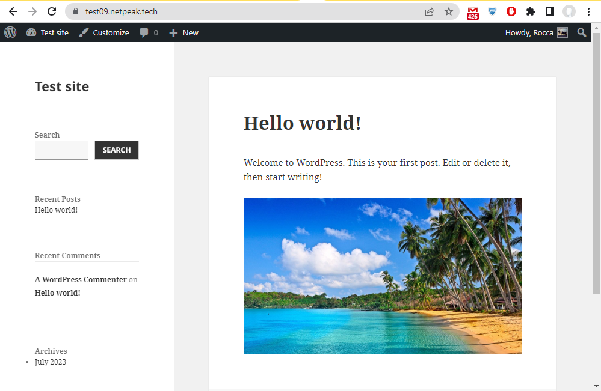

Для запуску та перевірки роботи пайплайнів внесемо деяку зміну до вихідного коду додатку:  

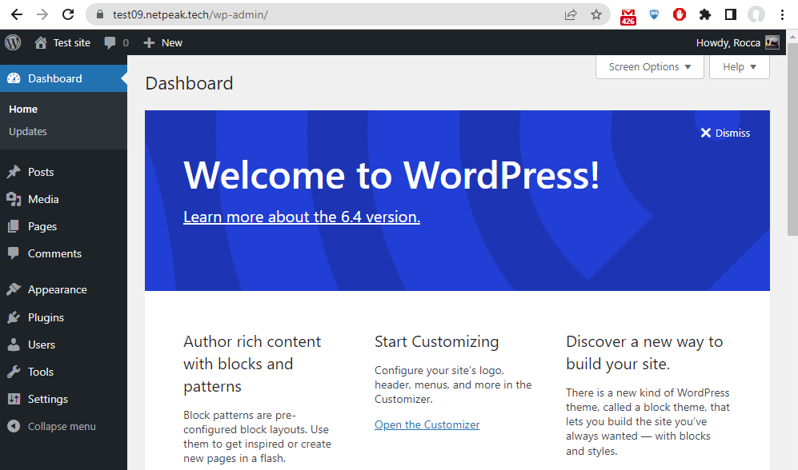

Замінимо, наприклад, 'WordPress' на 'TestPress':  

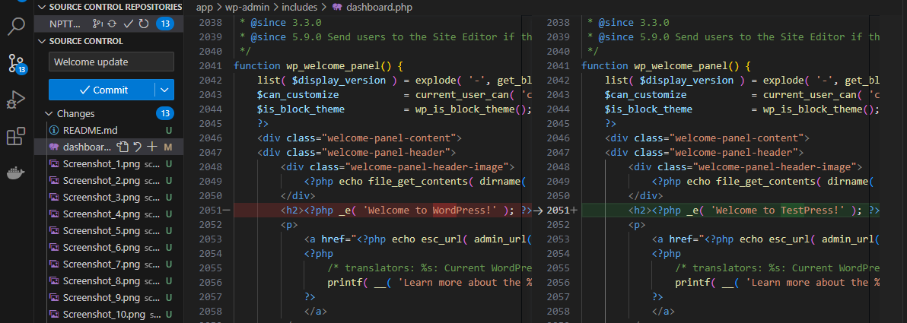

Після пушу коміту в репо на GitHub за github-webhook тріггером відбувається запуск CI-pipeline в Jenkins:  

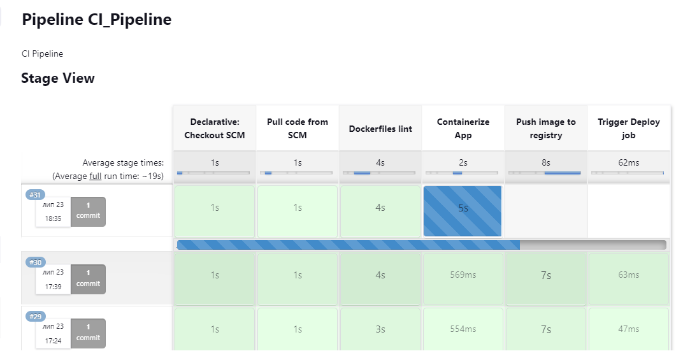

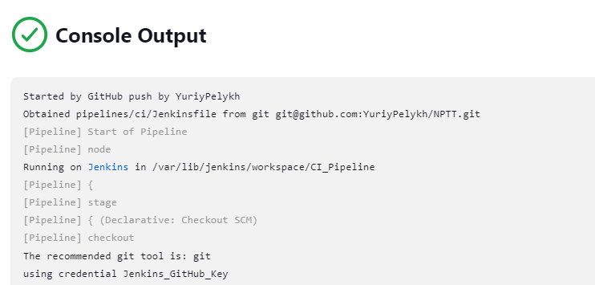

В процесі виконання CI_Pipeline з Dokerfile збирається образ нашого додатку Wordpress та пушиться в сховище DockerHub. Побудований образ тегується номером білда Jenkins:  

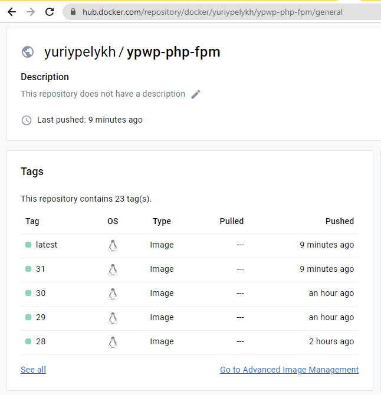

Останнім кроком відбувається триггеринг іншого пайплайну - CD_Pipeline:  

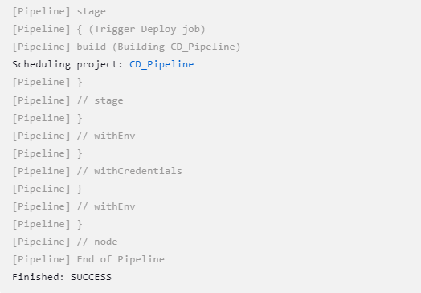

Із CI_Pipeline в downstream CD_Pipeline передається тег щойно зібраного Docker-образу за допомогою змінної `IMAGE_TAG` - таким чином CD_Pipeline розгортає далі зібрану версію образу за допомогою docker-compose:  

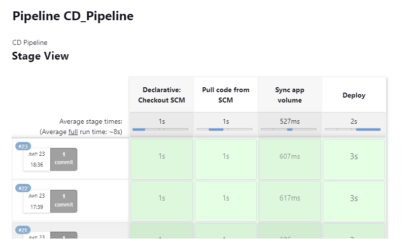

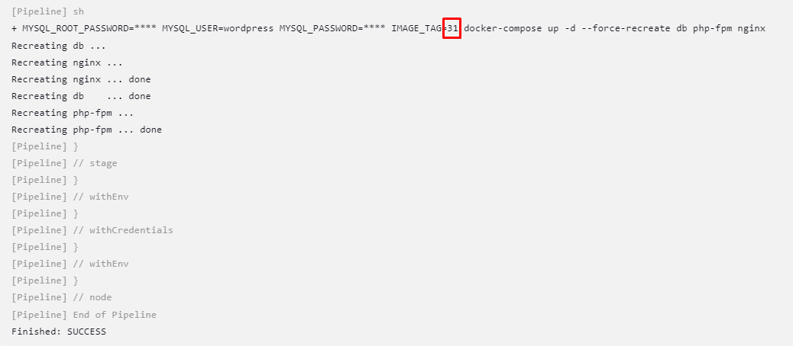

CD_Pipeline також може бути запущено окремо вручну. Це передбачає вибір версії (тегу) образу перед стартом пайплайна - Build with Parameters (усі можливі теги автоматично підтягуються із DockerHub - налаштовано через [Parameterized Trigger plugin](https://plugins.jenkins.io/parameterized-trigger/) та [Active Choices Plug-in](https://plugins.jenkins.io/uno-choice/)):  

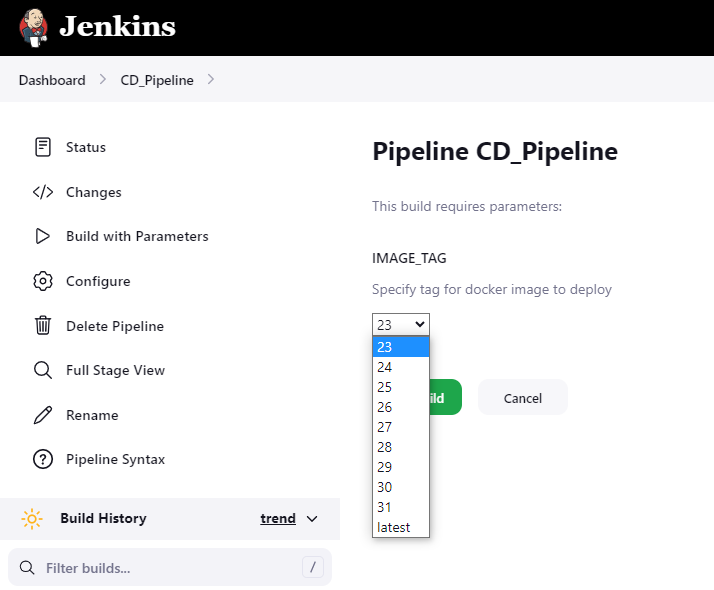

Перевірка результату:  

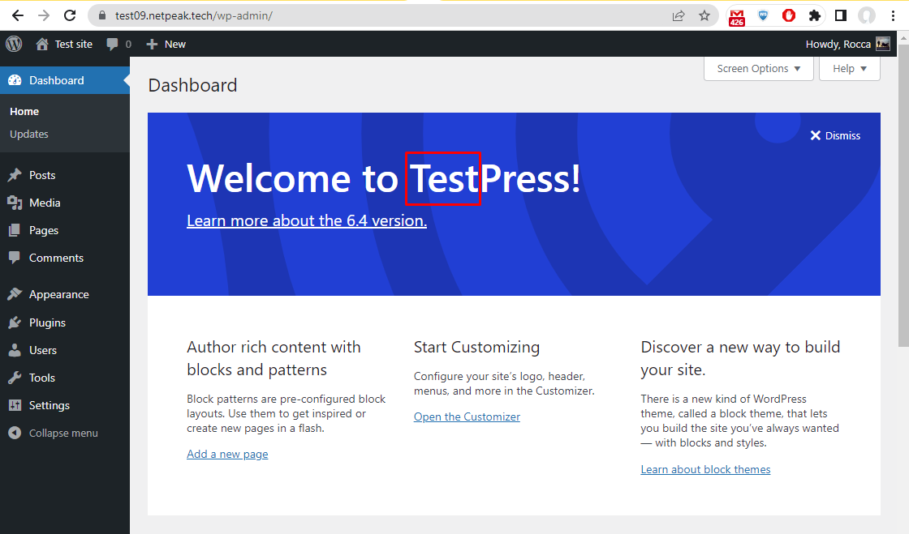